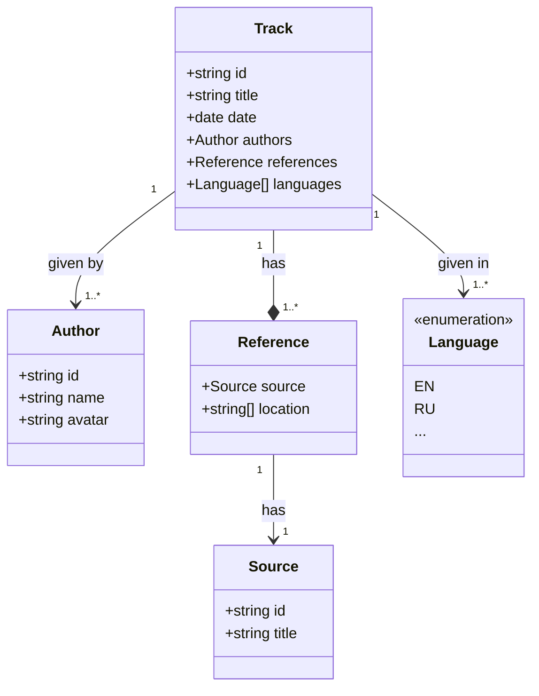
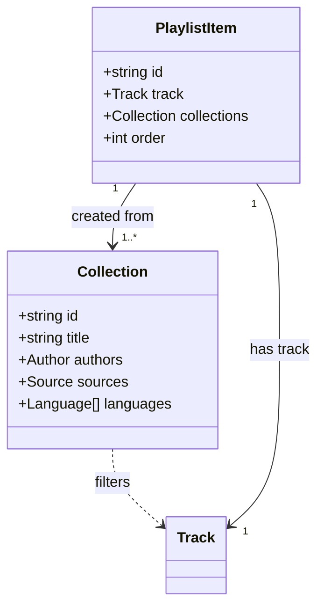

## Track and related models

```mermaid
classDiagram
    class Author {
        +string id
        +string name
        +string avatar
    }

    class Track {
        +string id
        +string title
        +date date
        +Author authors
        +Reference references
        +Language[] languages
    }

    class Reference {
        +Source source
        +string[] location
    }

    class Source {
        +string id
        +string title
    }

    class Language {
         <<enumeration>>
        EN
        RU
        ...
    }

    Track "1" --> "1..*" Author : given by
    Track "1" --* "1..*" Reference : has
    Track "1" --> "1..*" Language : given in
    Reference "1" --> "1" Source : has

```

## Collections and playlist

```mermaid
classDiagram
    class Collection {
        +string id
        +string title
        +Author authors
        +Source sources
        +Language[] languages
    }

    class PlaylistItem {
        +string id
        +Track track
        +Collection collections
        +int order
    }

    Collection ..> Track: filters

    PlaylistItem "1" --> "1..*" Collection : created from
    PlaylistItem "1" --> "1" Track : has track
```
